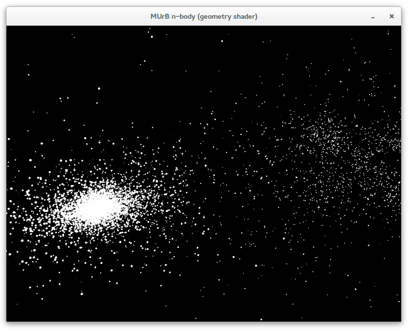

# MoveUrBody (MUrB), a n-body code

# How to compile and run the code
This project use `cmake` in order to generate any type of projects (Makefile, Visual Studio projects, Eclipse projects, etc.).

## Install cmake

### On Linux/Debian-like

Open a shell and type:

    $ sudo apt-get install cmake

## Get the Git submodules

MUrB depends on some other Git repositories (or submodules). It is highly recommended to get those submodules before trying to do anything else. Here is the command to get all the required submodules:

    $ git submodule update --init --recursive

## Other dependencies

MUrB comes with a realy cool real time display engine, to get it, you have to install some dependencies: `OpenGL`, `GLEW`, `GLM` and `GLFW` libraries are required.
If one on these libraries is missing on your system, then MUrB will be compiled in console mode only.

## Exemple of a Makefile project generation (with the C++ GNU compiler)

Open a shell and type (from the `MUrB` root folder):

    $ mkdir build
    $ cd build
    $ cmake .. -G"Unix Makefiles" -DCMAKE_CXX_COMPILER=g++ -DCMAKE_BUILD_TYPE=Release -DCMAKE_CXX_FLAGS="-funroll-loops -march=native -fopenmp"

## Compile the code with the Makefile

    $ make -j4

This command will use the generated Makefile.

## Run the code

Run 100 bodies (`-n`) during 1000 iterations (`-i`) and enable the verbose mode (`-v`):

    $ ./bin/Release/murb -n 100 -i 1000 -v

Expected output:

    Selected implementation: V1 - O(n²)

    n-body simulation configuration:
    --------------------------------
      -> random mode           : enable
      -> total nb. of bodies   : 100
      -> nb. of bodies per proc: 100
      -> nb. of iterations     : 1000
      -> verbose mode          : enable
      -> precision             : simple
      -> mem. allocated        : 0.00595093 MB
      -> geometry shader       : disable
      -> time step             : 3600.000000 sec
      -> nb. of MPI procs      : 1
      -> nb. of threads        : 1

    Compiling shader: ../src/common/ogl/shaders/vertex130.glsl
    Compiling shader: ../src/common/ogl/shaders/fragment130.glsl
    Linking shader program... SUCCESS !

    Simulation started...
    Iteration n°1000 took 0.133 ms (1.248 Gflop/s), physic time:   41d   16h    0m 0.000s
    Simulation ended.

    Entire simulation took 131.797 ms (1.259 Gflop/s)

If you want to try a SIMD implementation you can use the `--im` argument:

    $ ./bin/Release/murb -n 100 -i 1000 -v --im 13

Expected output:

    Selected implementation: V1 + intrinsics - O(n²)

    n-body simulation configuration:
    --------------------------------
      -> random mode           : enable
      -> total nb. of bodies   : 100
      -> nb. of bodies per proc: 100
      -> nb. of iterations     : 1000
      -> verbose mode          : enable
      -> precision             : simple
      -> mem. allocated        : 0.00595093 MB
      -> geometry shader       : disable
      -> time step             : 3600.000000 sec
      -> nb. of MPI procs      : 1
      -> nb. of threads        : 1

    Compiling shader: ../src/common/ogl/shaders/vertex130.glsl
    Compiling shader: ../src/common/ogl/shaders/fragment130.glsl
    Linking shader program... SUCCESS !

    Simulation started...
    Iteration n°1000 took 0.013 ms (14.185 Gflop/s), physic time:   41d   16h    0m 0.000s
    Simulation ended.

    Entire simulation took 14.939 ms (12.344 Gflop/s)

For more information please use the `-v` argument.